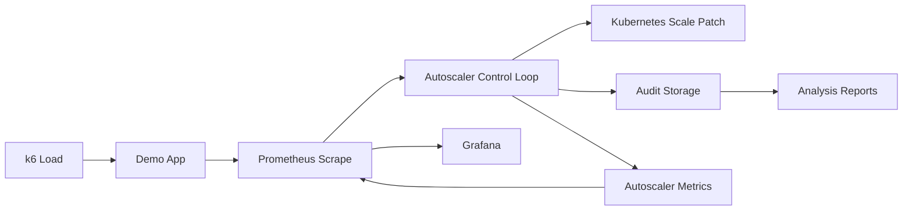

# thesis-autoscaling

Agent-based autoscaler for Kubernetes with:

- multi-agent decision pipeline (latency, throughput, error, saturation, optional OpenAI)
- arbitration + safety gate
- Prometheus/Grafana observability
- audit persistence (JSONL + DB backend)

## Problem This Project Solves

Most autoscaling setups rely on simple threshold rules (for example: CPU > X% => scale up).
That approach often fails in real workloads because:

- latency can degrade before CPU rises enough,
- error rate can spike briefly and then disappear,
- load can be bursty and trigger oscillation (scale up, then immediate scale down),
- cost can increase without improving user experience.

This project addresses that gap with a decision pipeline that is:

- multi-signal (latency, errors, throughput, saturation, optional LLM recommendation),
- safety-constrained (cooldowns, hysteresis, veto rules),
- fully observable (Prometheus + Grafana),
- explainable after the fact (audit payloads + timeline + replay).

In short: it aims to keep SLO behavior stable while avoiding unnecessary replica and API spend.

## How The Tech Stack Fits Together

The stack is split into cooperating layers, each with a clear role.

### 1) Workload Layer

- `app/` serves traffic and exports app metrics (`/metrics`).
- `load/` contains k6 profiles that generate realistic or stress traffic patterns.

### 2) Decision Layer

- `autoscaler/` runs the control loop.
- Agent recommendations are produced for latency, error, throughput, saturation, and optionally OpenAI.
- Arbitration chooses the minimum-penalty action candidate.
- Safety gate vetoes risky actions and enforces anti-thrashing policies.

### 3) Infrastructure Layer

- `k8s/` deploys app, autoscaler, Prometheus, and Grafana.
- The autoscaler patches deployment replicas through Kubernetes API.

### 4) Observability Layer

- Prometheus scrapes app/autoscaler metrics and evaluates alerts.
- Grafana visualizes operational and decision metrics.

### 5) Audit + Analysis Layer

- Decision-cycle records are stored in JSONL and DB backend.
- `analysis/` scripts produce scorecards, explainability timelines, and counterfactual replay outputs.

End-to-end flow:



## Quick Start

### 1. Prerequisites

- Docker Desktop (or compatible Docker runtime)
- kind
- kubectl
- k6

### 2. Local Configuration

```bash
cp .env.example .env
chmod +x scripts/*.sh
```

Key options in `.env`:

- `OPENAI_AGENT_ENABLED=true` to include OpenAI recommendations
- `OPENAI_INPUT_COST_PER_1M_TOKENS` and `OPENAI_OUTPUT_COST_PER_1M_TOKENS` for estimated cost tracking
- `OPENAI_MAX_TOTAL_COST_USD` and `OPENAI_MAX_TOTAL_TOKENS` for runtime budget guardrails (`0` disables)
- `MIN_SCALE_ACTION_INTERVAL_SECONDS`, `SCALE_DIRECTION_CHANGE_COOLDOWN_SECONDS`, and `SCALE_DOWN_RELEASE_MARGIN` for anti-thrashing safety
- `AUDIT_DB_BACKEND=sqlite|postgres`

### 3. Build And Deploy

```bash
./scripts/create-kind-cluster.sh
./scripts/install-metrics-server.sh
./scripts/install-kube-state-metrics.sh
./scripts/build-images.sh
./scripts/deploy-proposed.sh
```

Validate pods:

```bash
kubectl get pods -n thesis-autoscaling
```

## Runtime Access

Start forwards:

```bash
./scripts/port-forward.sh
kubectl port-forward svc/agent-autoscaler 8001:8001 -n thesis-autoscaling
```

Endpoints:

- Grafana: http://localhost:3000
- Prometheus: http://localhost:9090
- Demo app: http://localhost:8000
- Autoscaler health: http://localhost:8001/health
- Autoscaler metrics: http://localhost:8001/metrics

## Audit DB Backends

### SQLite mode

- Set `AUDIT_DB_BACKEND=sqlite`
- Uses `AUDIT_DB_PATH` (default `/tmp/autoscaler/audit.db`)

Query example:

```bash
kubectl exec -n thesis-autoscaling deploy/agent-autoscaler -- \
	python -c "import sqlite3; c=sqlite3.connect('/tmp/autoscaler/audit.db'); print(c.execute('select count(*) from audit_events').fetchone())"
```

### PostgreSQL sidecar mode

- Set `AUDIT_DB_BACKEND=postgres`
- The deployment includes sidecar container `audit-db` (PostgreSQL)

Query example:

```bash
kubectl exec -n thesis-autoscaling deploy/agent-autoscaler -c audit-db -- \
	psql -U autoscaler -d autoscaler -c "select count(*) from audit_events;"
```

For GUI setup in DBeaver, see:

- [reports/dbeaver_postgres_sidecar_setup.md](reports/dbeaver_postgres_sidecar_setup.md)

### Audit Table Schema (`public.audit_events`)

The audit table stores both flattened fields and full JSON payload for each decision cycle.

Fields:

- `id` (bigint, primary key)
- `created_at` (timestamptz, default `now()`)
- `timestamp_epoch` (double precision)
- `action` (text)
- `desired_replicas` (integer)
- `scaled` (integer)
- `rps` (double precision)
- `error_rate` (double precision)
- `p95_latency` (double precision)
- `inprogress` (integer)
- `current_replicas` (integer)
- `openai_action` (text)
- `openai_confidence` (double precision)
- `openai_reason` (text)
- `payload_json` (jsonb, full cycle payload)

Primary index:

- `audit_events_pkey` on `id`

## Metrics To Watch

### Core App Metrics (service health)

1. `demo_app_requests_total`

- What it means: cumulative request count by method/endpoint/status.
- Why it matters: base signal for throughput and error-rate calculations.

2. `demo_app_request_latency_seconds_bucket`

- What it means: histogram buckets for request latency.
- Why it matters: used to compute p95 latency via `histogram_quantile`.

3. `demo_app_inprogress_requests`

- What it means: currently active requests.
- Why it matters: saturation proxy; helps avoid under-provisioning.

### Autoscaler Control Metrics (decision behavior)

1. `autoscaler_decisions_total`

- What it means: count of decision cycles, typically with labels (action/veto).
- Why it matters: reveals control-loop behavior and veto frequency over time.

2. `autoscaler_current_desired_replicas`

- What it means: latest desired replica target computed by the autoscaler.
- Why it matters: compare against actual deployment replicas to detect lag or instability.

3. `autoscaler_observed_rps`

- What it means: request rate observed by control loop at decision time.
- Why it matters: helps explain why scale actions were considered.

4. `autoscaler_observed_p95_latency_seconds`

- What it means: observed p95 latency at decision time.
- Why it matters: primary SLO pressure signal for scale-up decisions.

5. `autoscaler_observed_error_rate`

- What it means: observed error fraction at decision time.
- Why it matters: guards reliability during scale-down and noisy periods.

### OpenAI Metrics (optional decision augmentation)

1. `openai_agent_requests_total`

- What it means: OpenAI call count grouped by outcome (`success`, `error`, `budget_exceeded`, etc).
- Why it matters: confirms reliability and guardrail fallback behavior.

2. `openai_agent_prompt_tokens_total`

- What it means: cumulative prompt/input tokens.
- Why it matters: cost driver for request input size.

3. `openai_agent_completion_tokens_total`

- What it means: cumulative completion/output tokens.
- Why it matters: cost driver for model response size.

4. `openai_agent_tokens_total`

- What it means: cumulative total tokens.
- Why it matters: budget cap and trend tracking.

5. `openai_agent_estimated_cost_usd_total`

- What it means: estimated cumulative USD cost from configured token prices.
- Why it matters: ensures autoscaling intelligence stays within operational budget.

## Grafana: How To Read The Dashboard

Use dashboard panels as a causal chain, not isolated charts.

1. Request Rate (RPS)

- Rising RPS with stable latency/error usually means current capacity is still sufficient.

2. p95 Latency

- Persistent p95 increase with rising RPS indicates capacity pressure.
- If p95 stays high after scale-up, investigate app bottlenecks beyond replicas.

3. Error Rate

- If error rises while latency also rises, likely overload.
- If error rises alone, likely app/downstream failure, not only scaling.

4. Replicas (actual vs desired)

- `desired` rising before `actual` is normal short control lag.
- Repeated up/down sawtooth pattern suggests policy too aggressive or thresholds too tight.

5. OpenAI Tokens + Cost

- Token growth with normal decision quality is expected when OpenAI is enabled.
- `budget_exceeded` outcomes indicate guardrails are actively protecting cost.

6. Vetoed Decisions

- Occasional vetoes are healthy safety behavior.
- Sustained veto surges suggest conflicting policy signals or unstable workload.

## Quick Operational Heuristics

1. Healthy run

- p95 and error near thresholds,
- replicas adjust without frequent reversals,
- veto rate low/moderate,
- no uncontrolled OpenAI cost growth.

2. Likely under-provisioned

- p95 up + error up + inprogress up + desired replicas climbing.

3. Likely over-provisioned

- low p95/error for long periods + low RPS + replicas stay high.

4. Policy friction

- many vetoes + little effective scaling.
  Tune cooldowns/hysteresis and review thresholds.

## Load Profiles

Recommended: use the automatic load runner to always generate organized artifacts.

Interactive mode (choose from terminal menu):

```bash
./scripts/run-loads.sh --interactive
```

Single profile:

```bash
./scripts/run-loads.sh steady
```

Two profiles in parallel:

```bash
./scripts/run-loads.sh --parallel spike sawtooth
```

All profiles:

```bash
./scripts/run-loads.sh --all
```

Each run creates `results/load_runs_YYYYMMDD_HHMMSS/` with:

- `status.txt`
- `json/*_summary.json`
- `logs/*.log`

Manual direct k6 commands (optional):

```bash
k6 run load/steady.js
k6 run load/burst.js
k6 run load/ramp.js
k6 run load/spike.js
k6 run load/soak.js
k6 run load/sawtooth.js
k6 run load/reality_simulation.js
```

## High-ROI Analysis Tooling (Phase 1 MVP)

The repository now includes three analysis scripts under `analysis/`:

1. Baseline benchmark scorecard

```bash
python3 analysis/benchmark_scorecard.py \
	--candidate /tmp/k6-spike-summary.json \
	--baseline /tmp/k6-sawtooth-summary.json \
	--output results/json/benchmark_scorecard_spike_vs_sawtooth.json
```

2. Explainability timeline (read-only)

```bash
python3 analysis/explainability_timeline.py \
	--jsonl /tmp/audit_payloads.jsonl \
	--limit 40 \
	--output reports/explainability_timeline_latest.md
```

3. Counterfactual replay MVP

```bash
python3 analysis/counterfactual_replay.py \
	--jsonl /tmp/audit_payloads.jsonl \
	--limit 120 \
	--w-cost 0.2 \
	--w-disagreement 0.1 \
	--output results/json/counterfactual_replay_summary.json
```

4. Full phase runner (one command)

```bash
python3 analysis/phase1_runner.py \
	--candidate /tmp/k6-spike-summary.json \
	--baseline /tmp/k6-sawtooth-summary.json \
	--jsonl /tmp/audit_payloads.jsonl \
	--output-dir results
```

Optional export from Postgres sidecar to JSONL for the timeline/replay scripts:

```bash
kubectl exec -n thesis-autoscaling deploy/agent-autoscaler -c audit-db -- \
	psql -U autoscaler -d autoscaler -At -c "select payload_json::text from audit_events order by id desc limit 120" \
	> /tmp/audit_payloads.jsonl
```

## Results Folder

Reports and run notes are stored in `reports/`.
JSON artifacts are stored in `results/json/`.

- [reports/latest_validation_report.md](reports/latest_validation_report.md)
- [reports/latest_validation_report_v2.md](reports/latest_validation_report_v2.md)
- [reports/cheat_sheet_runbook_el.md](reports/cheat_sheet_runbook_el.md)
- [reports/security_and_kos_report.md](reports/security_and_kos_report.md)
- [reports/first_presentation_flow_guide.md](reports/first_presentation_flow_guide.md)
- [reports/showcase_presentation_step_by_step.md](reports/showcase_presentation_step_by_step.md)
- [reports/how_it_works_a_to_omega.md](reports/how_it_works_a_to_omega.md)
- [reports/dbeaver_postgres_sidecar_setup.md](reports/dbeaver_postgres_sidecar_setup.md)
- [reports/load_test_sawtooth_report.md](reports/load_test_sawtooth_report.md)
- [reports/load_test_spike_report.md](reports/load_test_spike_report.md)
- [results/json/benchmark_scorecard_spike_vs_sawtooth.json](results/json/benchmark_scorecard_spike_vs_sawtooth.json)
- [reports/explainability_timeline_latest.md](reports/explainability_timeline_latest.md)
- [results/json/counterfactual_replay_summary.json](results/json/counterfactual_replay_summary.json)
- [results/json/counterfactual_replay_latency_priority.json](results/json/counterfactual_replay_latency_priority.json)
- [results/json/phase1_runner_manifest.json](results/json/phase1_runner_manifest.json)
- [reports/phase1_todos_completion.md](reports/phase1_todos_completion.md)

## Project Structure

- `app/`: demo service
- `autoscaler/`: decision logic, agents, runtime
- `analysis/`: analysis scripts
- `k8s/`: manifests
- `load/`: k6 scenarios
- `scripts/`: bootstrap/deploy helpers
- `results/`: generated run artifacts + JSON outputs
- `reports/`: markdown reports and runbooks
