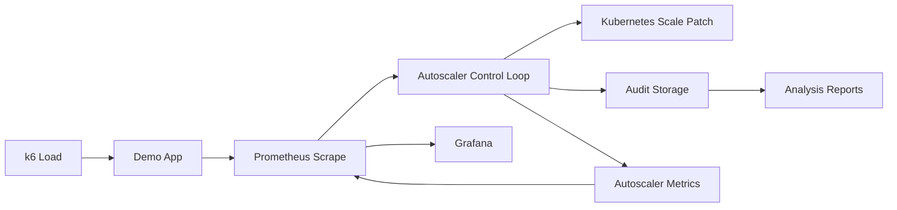

# Beyond HPA: A Multi-Agent Autoscaling System for Kubernetes with LangGraph

> Academic thesis / research prototype for application-aware Kubernetes
> autoscaling using multi-agent recommendations, weighted arbitration,
> safety veto rules, Grafana, Prometheus and LangGraph orchestration.

---

## Academic Notice

> This repository contains an academic research prototype developed as part of
> a thesis project.
>
> It is intended for research, reproducibility, educational review, and
> portfolio presentation.

---

## Copyright

Copyright (c) 2026 Ilias Mazarakis.

Unless otherwise stated, all original source code, design, documentation, and
evaluation logic in this repository were created by the author as part of the
thesis project.

## Problem This Project Solves

Most autoscaling setups rely on simple threshold rules (for example: CPU > X% => scale up).
That approach often fails in real workloads because:

- latency can degrade before CPU rises enough,
- error rate can spike briefly and then disappear,
- load can be bursty and trigger oscillation (scale up, then immediate scale down),
- cost can increase without improving user experience.

This project addresses that gap with a decision pipeline that is:

- multi-signal (latency, errors, throughput, saturation, optional LLM recommendation),
- safety-constrained (cooldowns, hysteresis, veto rules),
- fully observable (Prometheus + Grafana),
- explainable after the fact (audit payloads + timeline + replay).

In short: it aims to keep SLO behavior stable while avoiding unnecessary replica and API spend.

## How The Tech Stack Fits Together

The stack is split into cooperating layers, each with a clear role.

### 1) Workload Layer

- `app/` serves traffic and exports app metrics (`/metrics`).
- `load/` contains k6 profiles that generate realistic or stress traffic patterns.

### 2) Decision Layer

- `autoscaler/` runs the control loop.
- Agent recommendations are produced for latency, error, throughput, saturation, and optionally OpenAI.
- Arbitration chooses the minimum-penalty action candidate.
- Safety gate vetoes risky actions and enforces anti-thrashing policies.

### 3) Infrastructure Layer

- `k8s/` deploys app, autoscaler, Prometheus, and Grafana.
- The autoscaler patches deployment replicas through Kubernetes API.

### 4) Observability Layer

- Prometheus scrapes app/autoscaler metrics and evaluates alerts.
- Grafana visualizes operational and decision metrics.

### 5) Audit + Analysis Layer

- Decision-cycle records are stored in JSONL and DB backend.
- `analysis/` scripts produce scorecards, explainability timelines, and counterfactual replay outputs.

End-to-end flow:


```mermaid
flowchart LR
	L[k6 Load] --> A[Demo App]
	A --> P[Prometheus Scrape]
	P --> C[Autoscaler Control Loop]
	C --> K[Kubernetes Scale Patch]
	C --> D[Audit Storage]
	C --> M[Autoscaler Metrics]
	M --> P
	P --> G[Grafana]
	D --> R[Analysis Reports]
```

## Quick Start

### 1. Prerequisites

- Docker Desktop (or compatible Docker runtime)
- kind
- kubectl
- k6

### 2. Local Configuration

```bash
cp .env.example .env
chmod +x scripts/*.sh
```

Key options in `.env`:

- `OPENAI_AGENT_ENABLED=true` to include OpenAI recommendations
- `OPENAI_INPUT_COST_PER_1M_TOKENS` and `OPENAI_OUTPUT_COST_PER_1M_TOKENS` for estimated cost tracking
- `OPENAI_MAX_TOTAL_COST_USD` and `OPENAI_MAX_TOTAL_TOKENS` for runtime budget guardrails (`0` disables)
- `MIN_SCALE_ACTION_INTERVAL_SECONDS`, `SCALE_DIRECTION_CHANGE_COOLDOWN_SECONDS`, and `SCALE_DOWN_RELEASE_MARGIN` for anti-thrashing safety
- `AUDIT_DB_BACKEND=sqlite|postgres`
- `LOG_DIR=storage/logs/autoscaler` for channel logs (`lifecycle`, `errors`, `metrics`, `agents`, `arbitration`, `safety`, `scaling`, `audit`, `timeline`)

## Arbitration Weights

The arbitrator evaluates `scale_down`, `hold`, and `scale_up` by computing a weighted penalty score.
The action with the minimum total score is selected.

Score formula:

```text
total_score =
	WEIGHT_LATENCY * latency_penalty
	+ WEIGHT_ERROR * error_penalty
	+ WEIGHT_SATURATION * saturation_penalty
	+ WEIGHT_THROUGHPUT * throughput_penalty
	+ WEIGHT_COST * cost_penalty
	+ WEIGHT_AGENT_DISAGREEMENT * disagreement_penalty
```

Mathematical form:

$$
S(a) = w_L P_L(a) + w_E P_E(a) + w_S P_S(a) + w_T P_T(a) + w_C P_C(a) + w_D P_D(a)
$$

$$
a^* = \arg\min_{a \in \{d,h,u\}} S(a)
$$

Action mapping: $d$ means scale-down, $h$ means hold, $u$ means scale-up.

Where normalization and penalties are:

$$
n(x,\tau)=\min\left(\frac{x}{\tau},2.0\right)
$$

$$
P_L(a)=n(p95,\tau_L)\,f(a),\;
P_E(a)=n(err,\tau_E)\,f(a),\;
P_S(a)=n(inprogress,\tau_S)\,f(a)
$$

$$
r_{rep}=\frac{rps}{\max(replicas,1)},\;
P_T(a)=n(r_{rep},\tau_T)\,f(a)
$$

$$
P_C(a)=\frac{R_a-MIN}{MAX-MIN}\,m(a)
$$

$$
m(u)=1.15,\;m(d)=0.85,\;m(h)=1.00
$$

$$
P_D(a)=\frac{\sum_i c_i\,I(a_i\neq a)}{\sum_i c_i}
$$

$$
f(u)=\alpha_u,\;f(d)=\alpha_d,\;f(h)=\alpha_h
$$

Config mapping: $\alpha_u$, $\alpha_d$, and $\alpha_h$ correspond to env vars `ACTION_EFFECT_UP`, `ACTION_EFFECT_DOWN`, and `ACTION_EFFECT_HOLD`.

How to read these formulas in practice:

- `norm(x, τ)` converts each signal to a comparable penalty scale and caps extremes at `2.0`.
- `f(a)` models expected action impact: values `< 1` make penalties lighter for an action, values `> 1` make them heavier.
- `P_C(a)` is replica-cost pressure normalized between min/max replica bounds, then biased by action (`m(a)`).
- `P_D(a)` increases when high-confidence agents disagree with candidate action `a`.
- Final selection always picks the smallest score: lower is better.

Quick mini-example:

Assume for candidate `hold`:

- `P_L=1.20`, `P_E=0.40`, `P_S=0.80`, `P_T=1.00`, `P_C=0.30`, `P_D=0.50`
- Weights: `w_L=0.30`, `w_E=0.25`, `w_S=0.15`, `w_T=0.15`, `w_C=0.10`, `w_D=0.20`

Then:

$$
S(h) = 0.30\cdot1.20 + 0.25\cdot0.40 + 0.15\cdot0.80 + 0.15\cdot1.00 + 0.10\cdot0.30 + 0.20\cdot0.50 = 0.86
$$

Compute the same for `scale_up` and `scale_down`; whichever has the lowest $S(a)$ is chosen.

Default weight configuration:

- `WEIGHT_LATENCY=0.30`: prioritizes p95 latency protection.
- `WEIGHT_ERROR=0.25`: prioritizes reliability/error-rate protection.
- `WEIGHT_SATURATION=0.15`: captures overload pressure (`inprogress` signal).
- `WEIGHT_THROUGHPUT=0.15`: tracks requests-per-second per replica efficiency.
- `WEIGHT_COST=0.10`: penalizes higher replica cost.
- `WEIGHT_AGENT_DISAGREEMENT=0.20`: penalizes conflicting agent recommendations.

Where to set them:

- In local `.env` for non-Kubernetes runs.
- In `k8s/autoscaler-deployment.yaml` for cluster deployment.

Practical tuning hints:

- Increase `WEIGHT_LATENCY` and/or `WEIGHT_ERROR` when SLO protection is the top priority.
- Increase `WEIGHT_COST` when cost control matters more than aggressive scaling.
- Increase `WEIGHT_AGENT_DISAGREEMENT` when you want safer behavior under conflicting signals.
- Keep changes small and iterative (for example, `0.05` per step), then validate via load profiles and audit replay.

### 3. Build And Deploy

```bash
./scripts/create-kind-cluster.sh
./scripts/install-metrics-server.sh
./scripts/install-kube-state-metrics.sh
./scripts/build-images.sh
./scripts/deploy-proposed.sh
```

Validate pods:

```bash
kubectl get pods -n thesis-autoscaling
```

## Runtime Access

Start forwards:

```bash
./scripts/port-forward.sh
kubectl port-forward svc/agent-autoscaler 8001:8001 -n thesis-autoscaling
```

Endpoints:

- Grafana: http://localhost:3000
- Prometheus: http://localhost:9090
- Demo app: http://localhost:8000
- Autoscaler health: http://localhost:8001/health
- Autoscaler metrics: http://localhost:8001/metrics

## Audit DB Backends

### SQLite mode

- Set `AUDIT_DB_BACKEND=sqlite`
- Uses `AUDIT_DB_PATH` (default `/tmp/autoscaler/audit.db`)

Query example:

```bash
kubectl exec -n thesis-autoscaling deploy/agent-autoscaler -- \
	python -c "import sqlite3; c=sqlite3.connect('/tmp/autoscaler/audit.db'); print(c.execute('select count(*) from audit_events').fetchone())"
```

### PostgreSQL sidecar mode

- Set `AUDIT_DB_BACKEND=postgres`
- The deployment includes sidecar container `audit-db` (PostgreSQL)

Query example:

```bash
kubectl exec -n thesis-autoscaling deploy/agent-autoscaler -c audit-db -- \
	psql -U autoscaler -d autoscaler -c "select count(*) from audit_events;"
```

For GUI setup in DBeaver, see:

- [docs.local/dbeaver_postgres_sidecar_setup.md](docs.local/dbeaver_postgres_sidecar_setup.md)

### Audit Table Schema (`public.audit_events`)

The audit table stores both flattened fields and full JSON payload for each decision cycle.

Fields:

- `id` (bigint, primary key)
- `created_at` (timestamptz, default `now()`)
- `timestamp_epoch` (double precision)
- `action` (text)
- `desired_replicas` (integer)
- `scaled` (integer)
- `rps` (double precision)
- `error_rate` (double precision)
- `p95_latency` (double precision)
- `inprogress` (integer)
- `current_replicas` (integer)
- `openai_action` (text)
- `openai_confidence` (double precision)
- `openai_reason` (text)
- `payload_json` (jsonb, full cycle payload)

Primary index:

- `audit_events_pkey` on `id`

## Metrics To Watch

### Core App Metrics (service health)

1. `demo_app_requests_total`

- What it means: cumulative request count by method/endpoint/status.
- Why it matters: base signal for throughput and error-rate calculations.

2. `demo_app_request_latency_seconds_bucket`

- What it means: histogram buckets for request latency.
- Why it matters: used to compute p95 latency via `histogram_quantile`.

3. `demo_app_inprogress_requests`

- What it means: currently active requests.
- Why it matters: saturation proxy; helps avoid under-provisioning.

### Autoscaler Control Metrics (decision behavior)

1. `autoscaler_decisions_total`

- What it means: count of decision cycles, typically with labels (action/veto).
- Why it matters: reveals control-loop behavior and veto frequency over time.

2. `autoscaler_current_desired_replicas`

- What it means: latest desired replica target computed by the autoscaler.
- Why it matters: compare against actual deployment replicas to detect lag or instability.

3. `autoscaler_observed_rps`

- What it means: request rate observed by control loop at decision time.
- Why it matters: helps explain why scale actions were considered.

4. `autoscaler_observed_p95_latency_seconds`

- What it means: observed p95 latency at decision time.
- Why it matters: primary SLO pressure signal for scale-up decisions.

5. `autoscaler_observed_error_rate`

- What it means: observed error fraction at decision time.
- Why it matters: guards reliability during scale-down and noisy periods.

### OpenAI Metrics (optional decision augmentation)

1. `openai_agent_requests_total`

- What it means: OpenAI call count grouped by outcome (`success`, `error`, `budget_exceeded`, etc).
- Why it matters: confirms reliability and guardrail fallback behavior.

2. `openai_agent_prompt_tokens_total`

- What it means: cumulative prompt/input tokens.
- Why it matters: cost driver for request input size.

3. `openai_agent_completion_tokens_total`

- What it means: cumulative completion/output tokens.
- Why it matters: cost driver for model response size.

4. `openai_agent_tokens_total`

- What it means: cumulative total tokens.
- Why it matters: budget cap and trend tracking.

5. `openai_agent_estimated_cost_usd_total`

- What it means: estimated cumulative USD cost from configured token prices.
- Why it matters: ensures autoscaling intelligence stays within operational budget.

## Grafana: How To Read The Dashboard

Use dashboard panels as a causal chain, not isolated charts.

1. Request Rate (RPS)

- Rising RPS with stable latency/error usually means current capacity is still sufficient.

2. p95 Latency

- Persistent p95 increase with rising RPS indicates capacity pressure.
- If p95 stays high after scale-up, investigate app bottlenecks beyond replicas.

3. Error Rate

- If error rises while latency also rises, likely overload.
- If error rises alone, likely app/downstream failure, not only scaling.

4. Replicas (actual vs desired)

- `desired` rising before `actual` is normal short control lag.
- Repeated up/down sawtooth pattern suggests policy too aggressive or thresholds too tight.

5. OpenAI Tokens + Cost

- Token growth with normal decision quality is expected when OpenAI is enabled.
- `budget_exceeded` outcomes indicate guardrails are actively protecting cost.

6. Vetoed Decisions

- Occasional vetoes are healthy safety behavior.
- Sustained veto surges suggest conflicting policy signals or unstable workload.

## Quick Operational Heuristics

1. Healthy run

- p95 and error near thresholds,
- replicas adjust without frequent reversals,
- veto rate low/moderate,
- no uncontrolled OpenAI cost growth.

2. Likely under-provisioned

- p95 up + error up + inprogress up + desired replicas climbing.

3. Likely over-provisioned

- low p95/error for long periods + low RPS + replicas stay high.

4. Policy friction

- many vetoes + little effective scaling.
  Tune cooldowns/hysteresis and review thresholds.

## Load Profiles

Recommended: use the automatic load runner to always generate organized outputs.

Interactive mode (choose from terminal menu):

```bash
./scripts/run-loads.sh --interactive
```

Single profile:

```bash
./scripts/run-loads.sh steady
```

Two profiles in parallel:

```bash
./scripts/run-loads.sh --parallel spike sawtooth
```

All profiles:

```bash
./scripts/run-loads.sh --all
```

Each execution creates one named folder under `storage/runs/`, for example
`storage/runs/run_spike_YYYYMMDD_HHMMSS/`, containing:

- `status.txt`
- `*_summary.json`
- `audit_payloads.jsonl` (audit events observed during this run)
- `*.log`, `*.jsonl`, `aggregate.log`, and `timeline.log`
- `insights/report.md` and `insights/metrics.json`
- `insights/figure_*.png` (control response, SLO protection, efficiency, stability, and weight sensitivity)

The runtime autoscaler log remains in `storage/logs/autoscaler/` as the shared live
source; each run also copies its observed timeline into its own `timeline.log`.

Manual direct k6 commands (optional):

```bash
k6 run load/steady.js
k6 run load/burst.js
k6 run load/ramp.js
k6 run load/spike.js
k6 run load/soak.js
k6 run load/sawtooth.js
k6 run load/reality_simulation.js
```

## High-ROI Analysis Tooling (Phase 1 MVP)

The repository includes the following analysis scripts under `analysis/`:

### 1) Policy benchmark scorecard

Purpose:

- compare a candidate run against a baseline run
- score reliability, latency, and throughput in one comparable metric
- quantify whether a new policy is better or worse

The benchmark logic is intentionally simple and transparent:

```text
error_component = max(0, 1 - failed_rate) * 50
p95_component   = max(0, 1 - p95_ms / 2000) * 35
throughput_component = min(iterations / 10000, 1) * 15
score = error_component + p95_component + throughput_component
```

The script is implemented in `analysis/policy_benchmark.py` and can be run as:

```bash
python3 analysis/policy_benchmark.py \
	--candidate /tmp/k6-spike-summary.json \
	--baseline /tmp/k6-sawtooth-summary.json \
	--output storage/json/policy_benchmark_report.json
```

The result includes:

- `candidate_score`
- `baseline_score`
- `score_delta`
- `score_delta_pct`
- `failed_rate_delta_pct`
- `p95_ms_delta_pct`
- `iterations_delta_pct`

This is the comparison mechanism used for evaluating policy variants across workload profiles.

### 2) Run summary for each execution

Purpose:

- summarize a run in a human-readable way
- show the final action distribution for the run
- show average footprint of the workload and the decision loop
- highlight safety veto counts and agent activity

The summary logic is implemented in `analysis/run_summary.py` and follows this structure:

```python
summary = {
    "total_cycles": len(events),
    "final_action_distribution": {"scale_up": x, "scale_down": y, "hold": z},
    "avg_rps": ...,
    "avg_latency": ...,
    "avg_error_rate": ...,
    "avg_inprogress": ...,
    "veto_summary": {...},
    "policy_summary": {...},
}
```

The markdown output contains:

- Final action distribution
- Snapshot averages
- Safety veto summary
- Agent activity

Example:

```bash
python3 analysis/run_summary.py \
	--jsonl /tmp/audit_payloads.jsonl \
	--output storage/json/run_summary.md
```

This script produces a readable report for presentation, review, and follow-up analysis.

### 3) Post-run insights and correlations

The load runner automatically exports the new audit events after the run and executes:

```bash
python3 analysis/run_insights.py \
	--jsonl storage/runs/load_runs_YYYYMMDD_HHMMSS/json/audit_payloads.jsonl \
	--output-dir storage/runs/load_runs_YYYYMMDD_HHMMSS/insights
```

The report includes action and veto distributions, SLO violation ratios, average signals,
and Pearson correlations between current replicas and RPS, latency, error rate, and
in-progress requests. The aggregate log records the artifact paths and keeps explicit
profile and analysis sections so important outcomes remain easy to find.

### 4) Agentic versus HPA comparison

The two controllers should run sequentially in the same workspace, with separate run
directories. Do not attach both controllers to `demo-app` at the same time.

Run and preserve the agentic result:

```bash
./scripts/run-loads.sh spike --out-dir storage/runs/agentic
```

For the HPA trial, remove the agentic autoscaler deployment and apply:

```bash
kubectl delete deployment agent-autoscaler -n thesis-autoscaling
kubectl apply -f k8s/hpa.yaml
./scripts/run-loads.sh spike --out-dir storage/runs/hpa
```

Create one combined comparison report:

```bash
python3 analysis/compare_controllers.py \
	--agentic-run storage/runs/agentic/run_spike_TIMESTAMP \
	--hpa-run storage/runs/hpa/run_spike_TIMESTAMP \
	--output-dir storage/runs/insights/controller-comparison
```

The comparison directory contains `controller_comparison.md`,
`controller_comparison.json`, and `controller_comparison.png`. The comparison is valid
only when the same profile, application image, resource requests, replica bounds, and
number of repetitions are used.

For the complete sequential experiment and automatic restoration of the agentic
controller, use one command:

```bash
./scripts/compare-agentic-hpa.sh spike
```

The script runs the selected profile once per controller and writes everything under
`storage/runs/controller_comparisons/TIMESTAMP/`. It requires `kind`, `kubectl`, `k6`,
Docker, and a working metrics-server.

### 5) Bayesian-style policy optimizer

Purpose:

- search over weight profiles
- optimize for a better cost/SLO/stability trade-off
- support policy tuning without manual guessing

The optimization layer is intentionally lightweight rather than a heavy ML stack. It searches candidate weight sets around the current best policy and scores them against the runtime objective.

Conceptually:

```text
objective = weight_latency * latency_term
          + weight_error * reliability_term
          + weight_throughput * throughput_term
          + weight_cost * (100 - cost_penalty)
```

The optimizer evaluates candidate profiles and keeps the one with the highest objective.

Implementation:

```bash
python3 analysis/bayesian_optimizer.py \
	--candidate /tmp/k6-spike-summary.json \
	--baseline /tmp/k6-sawtooth-summary.json \
	--iterations 25 \
	--output storage/json/bayesian_policy_search.json
```

The output includes:

- `best_weights`
- `best_objective`
- `candidate_score`
- `baseline_score`
- `comparison`

This is a lightweight tuning layer for the arbitration policy.

### 4) Baseline benchmark scorecard

```bash
python3 analysis/benchmark_scorecard.py \
	--candidate /tmp/k6-spike-summary.json \
	--baseline /tmp/k6-sawtooth-summary.json \
	--output storage/json/benchmark_scorecard_spike_vs_sawtooth.json
```

### 5) Explainability timeline (read-only)

```bash
python3 analysis/explainability_timeline.py \
	--jsonl /tmp/audit_payloads.jsonl \
	--limit 40 \
	--output storage/json/explainability_timeline_latest.md
```

### 6) Counterfactual replay MVP

```bash
python3 analysis/counterfactual_replay.py \
	--jsonl /tmp/audit_payloads.jsonl \
	--limit 120 \
	--w-cost 0.2 \
	--w-disagreement 0.1 \
	--output storage/json/counterfactual_replay_summary.json
```

### 7) Full phase runner (one command)

```bash
python3 analysis/phase1_runner.py \
	--candidate /tmp/k6-spike-summary.json \
	--baseline /tmp/k6-sawtooth-summary.json \
	--jsonl /tmp/audit_payloads.jsonl \
	--output-dir storage
```

### 8) Decision replay (single cycle debugging)

```bash
python3 analysis/decision_replay.py \
	--jsonl /tmp/audit_payloads.jsonl \
	--cycle-id 42
```

Or from SQLite backend:

```bash
python3 analysis/decision_replay.py \
	--sqlite /tmp/autoscaler/audit.db \
	--cycle-id 42 \
	--output docs.local/decision_replay_cycle_42.md
```

The replay output summarizes an end-to-end decision path for one cycle:

- metrics snapshot
- per-agent votes
- aggregation scores and selected action
- safety veto status
- replica transition and final decision

Optional export from Postgres sidecar to JSONL for the timeline/replay scripts:

```bash
kubectl exec -n thesis-autoscaling deploy/agent-autoscaler -c audit-db -- \
	psql -U autoscaler -d autoscaler -At -c "select payload_json::text from audit_events order by id desc limit 120" \
	> /tmp/audit_payloads.jsonl
```

## Output model and improvement backlog

The repository uses three complementary layers of operational evidence:

1. Raw logs
   - capture the full execution trail
   - used for forensic debugging and replay
   - stored under `storage/logs/`

2. Structured run artifacts
   - contain the normalized metrics, events, and decision snapshots
   - used for analysis and comparison
   - stored under `storage/runs/<run_id>/` and `storage/json/`

3. Human-readable summaries
   - condense a run into understandable output for review and reporting
   - not a replacement for the raw logs
   - generated per run with the summary scripts in `analysis/`

This separation is intentional: logs preserve evidence, summaries make the signal readable, and structured artifacts bridge the two.

Current cleanup and improvement items:

- keep one canonical output contract per run, including logs, structured JSON, and summary markdown
- ensure run names and folders stay consistent across all artifacts
- keep policy benchmark comparisons focused on a small set of canonical metrics
- maintain a single clear distinction between permanent repo docs and local-only notes
- expand the benchmark workflow into a repeatable multi-run comparison report

This is the current backlog for making the project clearer and more consistent without losing forensic traceability.

## Results Folder

Reports and run notes are stored in `docs.local/`.
JSON outputs are stored in `storage/json/`.

`docs.local/` is intentionally gitignored for personal documentation notes.

- [docs.local/latest_validation_report.md](docs.local/latest_validation_report.md)
- [docs.local/latest_validation_report_v2.md](docs.local/latest_validation_report_v2.md)
- [docs.local/cheat_sheet_runbook_el.md](docs.local/cheat_sheet_runbook_el.md)
- [docs.local/security_and_kos_report.md](docs.local/security_and_kos_report.md)
- [docs.local/first_presentation_flow_guide.md](docs.local/first_presentation_flow_guide.md)
- [docs.local/showcase_presentation_step_by_step.md](docs.local/showcase_presentation_step_by_step.md)
- [docs.local/how_it_works_a_to_omega.md](docs.local/how_it_works_a_to_omega.md)
- [docs.local/dbeaver_postgres_sidecar_setup.md](docs.local/dbeaver_postgres_sidecar_setup.md)
- [docs.local/load_test_sawtooth_report.md](docs.local/load_test_sawtooth_report.md)
- [docs.local/load_test_spike_report.md](docs.local/load_test_spike_report.md)
- [storage/json/benchmark_scorecard_spike_vs_sawtooth.json](storage/json/benchmark_scorecard_spike_vs_sawtooth.json)
- [docs.local/explainability_timeline_latest.md](docs.local/explainability_timeline_latest.md)
- [storage/json/counterfactual_replay_summary.json](storage/json/counterfactual_replay_summary.json)
- [storage/json/counterfactual_replay_latency_priority.json](storage/json/counterfactual_replay_latency_priority.json)
- [storage/json/phase1_runner_manifest.json](storage/json/phase1_runner_manifest.json)
- [docs.local/phase1_todos_completion.md](docs.local/phase1_todos_completion.md)

## Project Structure

- `app/`: demo service
- `autoscaler/`: decision logic, agents, runtime
- `analysis/`: analysis scripts
- `k8s/`: manifests
- `load/`: k6 scenarios
- `scripts/`: bootstrap/deploy helpers
- `storage/`: generated run outputs, logs, and JSON outputs
- `docs.local/`: local markdown reports and runbooks (gitignored)
