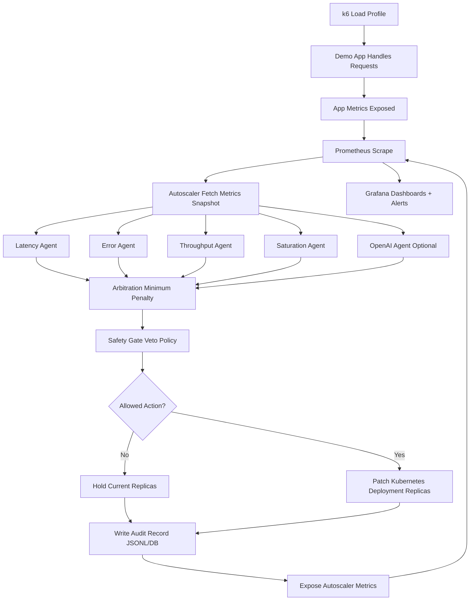

# How It Works A-to-Omega

Date: 2026-07-12

## 1) System Goal

Build an SLO-oriented autoscaler that:

- keeps service latency/error within thresholds,
- avoids unnecessary replica cost,
- stays safe under noisy/rapidly changing load,
- remains explainable through full audit trails.

## 2) Tech Stack

### Core Runtime

- Python 3.11
- FastAPI for autoscaler service endpoints
- LangGraph for orchestration of the decision pipeline
- Pydantic for strongly typed state/models

### Control Plane / Infrastructure

- Kubernetes (kind local cluster)
- kubectl for deployment and operations
- Docker images for app and autoscaler

### Observability

- Prometheus for scraping + rules
- Grafana for dashboards
- Prometheus client library in autoscaler and app

### Decision Intelligence

- Multi-agent heuristic layer:
  - latency agent
  - throughput agent
  - error agent
  - saturation agent
- Optional OpenAI agent for recommendation augmentation

### Persistence and Analysis

- JSONL audit log
- SQLite backend (simple local mode)
- PostgreSQL sidecar backend (extended audit mode)
- k6 for load generation and performance experiments

## 3) Main Components

1. Demo app

- Exposes workload endpoint and app metrics.

2. Agent autoscaler

- Runs periodic control loop.
- Reads metrics, generates recommendations, arbitrates, applies safety, scales deployment, writes audit.

3. Prometheus

- Scrapes app and autoscaler metrics.
- Evaluates alert rules.

4. Grafana

- Visualizes latency, errors, replicas, OpenAI usage/cost, veto activity.

5. Audit DB

- Stores decision-cycle records for explainability and post-run analysis.

## 4) End-to-End Runtime Flow

## 5) Decision Pipeline Details

### Step A: Snapshot

Autoscaler reads:

- rps,
- p95 latency,
- error rate,
- in-progress requests,
- current replicas.

### Step B: Recommendation Layer

Each agent produces:

- action: scale_up, hold, scale_down,
- desired replicas,
- confidence,
- reason.

Optional OpenAI agent:

- can contribute recommendation,
- is guarded by token/cost limits,
- falls back to safe hold on budget exceed or API issues.

### Step C: Arbitration

Candidate actions are scored via weighted penalties:

- latency penalty,
- error penalty,
- saturation penalty,
- throughput penalty,
- cost penalty,
- disagreement penalty.

Lowest total penalty wins as aggregated decision.

### Step D: Safety Gate

Safety rules can override to hold. Examples:

- block scale_down if latency/error are high,
- scale cooldown windows,
- minimum interval between scale actions,
- direction-change cooldown,
- scale-down hysteresis release margin,
- invalid metrics guard.

### Step E: Actuation

If allowed and different from current:

- autoscaler patches target Deployment replicas.

### Step F: Audit + Observability

Each cycle stores:

- snapshot,
- all recommendations,
- arbitration scores,
- veto results,
- final decision,
- scaled true/false.

## 6) Security and Safety Mechanisms

1. Secret-based OpenAI key injection through Kubernetes Secret.
2. Runtime OpenAI guardrails:

- max total cost cap,
- max total tokens cap.

3. Defensive fallback behavior if OpenAI unavailable or budget exceeded.
4. Anti-thrashing controls in safety policy.
5. Alert rules for high error, high latency, budget events, and veto surges.

## 7) What Happens During a Typical Experiment

1. Deploy stack.
2. Start port-forward for Grafana/Prometheus/app.
3. Run load via interactive runner (`./scripts/run-loads.sh --interactive`) or explicit mode (`--parallel`, `--all`).
4. Observe live dashboards.
5. Verify autoscaler decisions and replica transitions.
6. Query audit DB for explainability.
7. Compare runs across profiles.

### Load Artifact Convention

Each load execution creates `results/load_runs_YYYYMMDD_HHMMSS/` with:

- `status.txt` (start/finish, selected profiles, per-profile exit code, overall_exit)
- `json/*_summary.json` (k6 summary exports)
- `logs/*.log` (full k6 output per profile)

This ensures reproducible experiment traces even when running one profile or multiple profiles in parallel.

## 8) Success Criteria

A run is considered healthy when:

- p95 and error stay near defined thresholds,
- scaling changes are stable (no excessive oscillation),
- budget guardrails are respected,
- audit records fully explain decision path.

## 9) File-Level Map

- Autoscaler runtime: [autoscaler/main.py](../autoscaler/main.py)
- Graph nodes (pipeline): [autoscaler/graph_nodes.py](../autoscaler/graph_nodes.py)
- Safety logic: [autoscaler/safety.py](../autoscaler/safety.py)
- Arbitration logic: [autoscaler/arbitration.py](../autoscaler/arbitration.py)
- OpenAI integration: [autoscaler/openai_agent.py](../autoscaler/openai_agent.py)
- Deployment config: [k8s/autoscaler-deployment.yaml](../k8s/autoscaler-deployment.yaml)
- Prometheus rules/scrape: [k8s/prometheus-configmap.yaml](../k8s/prometheus-configmap.yaml)
- Grafana dashboard: [k8s/grafana-dashboard-configmap.yaml](../k8s/grafana-dashboard-configmap.yaml)
