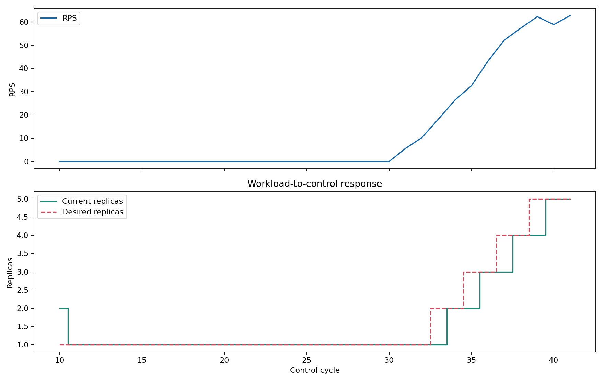
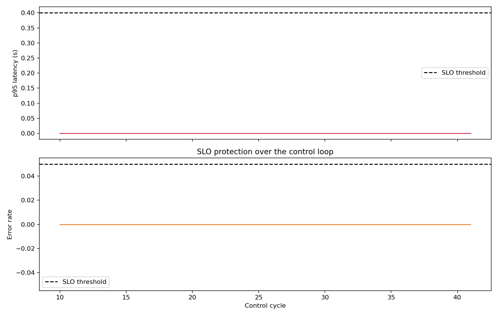
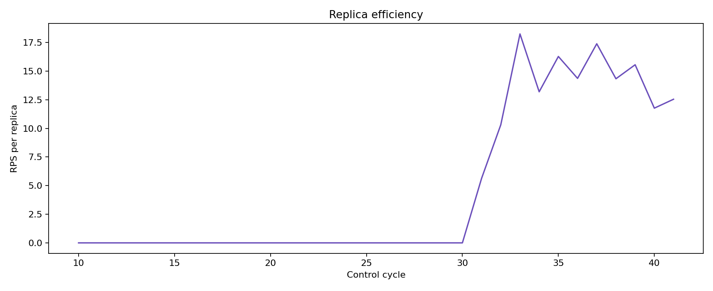
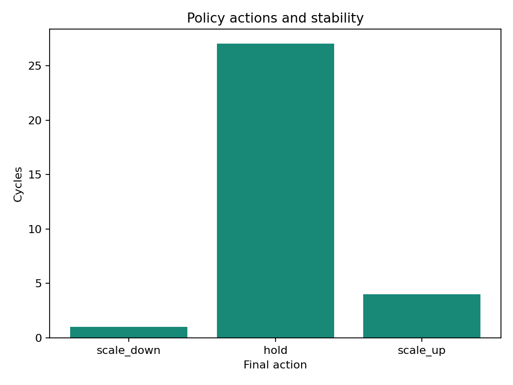
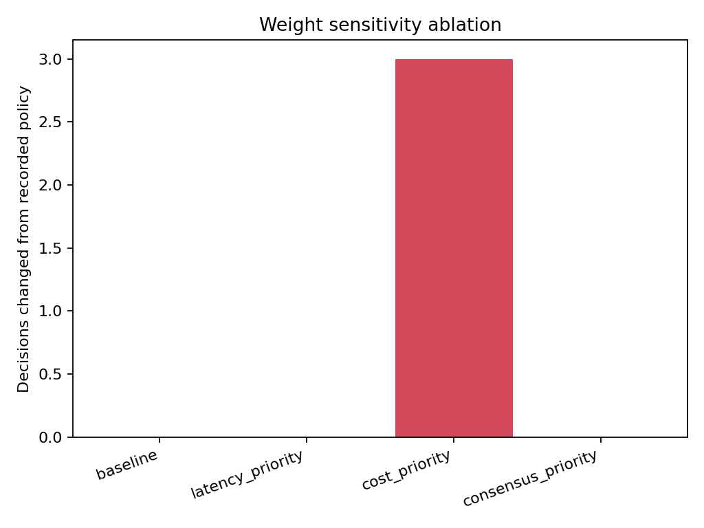

# Autoscaler Run Insights

Paper-oriented evaluation from structured audit events.

## Primary findings

- Control cycles: `32`; usable rows: `32`
- SLO violation ratio: `0.0`
- Action transition rate: `0.2903`
- Action distribution: `{'scale_down': 1, 'hold': 27, 'scale_up': 4}`
- Aggregate decisions before safety: `{'scale_down': 1, 'hold': 27, 'scale_up': 4}`
- Veto distribution: `none`

## Figures

## Interpretation note

Weight sensitivity is a counterfactual decision ablation using recorded penalty components. It reports how often the selected action would change; it does not simulate the future cluster response after that action.
Supplementary replica correlations are descriptive associations over audit cycles, not causal effects.
