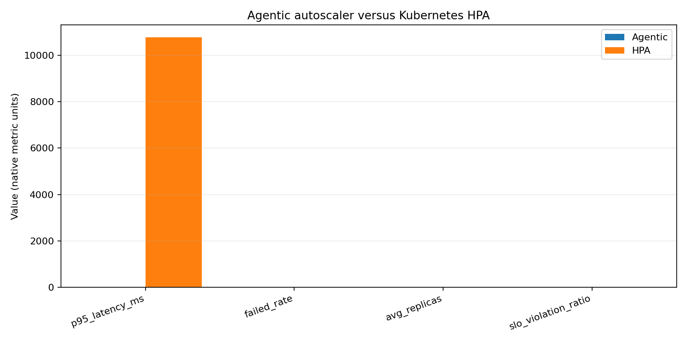

# Controller Comparison

Simple answer: which controller handled the same test better?

| What we measured | Agentic | HPA | Winner |
|---|---:|---:|---|
| Average waiting time | `14.780343041947688` | `3496.025868560553` | **Agentic** |
| Failed requests | `0.9890432260711117` | `0.030478714593341064` | **HPA** |
| Total requests | `419284.0` | `12074.0` | **Agentic** |
| Completed requests | `419284.0` | `12074.0` | **Agentic** |
| Max VUs | `600.0` | `600.0` | **tie** |
| Waiting time (p95) | `0.0` | `10763.142699999995` | **Agentic** |

## Agentic-only metrics

- Average workers (replicas): `1.6562`
- Scaling actions: `5`
- SLO violations: `0.0`
- Action changes: `0.2903`
- Safety blocks: `0`

## How to read this

- Waiting time, failures, SLO violations, workers, blocks, and action changes: **smaller is better**.
- Completed and total requests: **bigger is better** when the test duration is identical.
- `not measured` means that controller did not produce the needed data, so that row must not be used as evidence.
- This is one experiment, not proof that one controller is always better.

